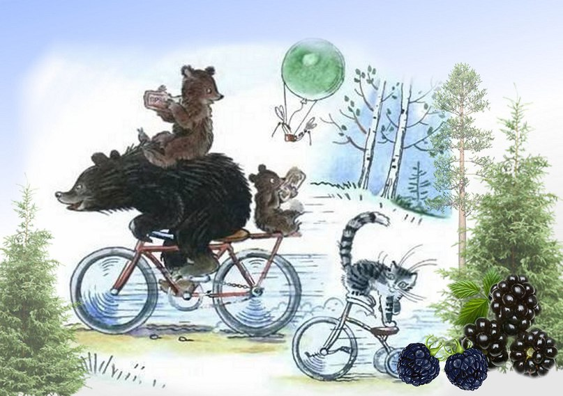

### Hi there 👋
[My cv](https://igor-sergeevich-po.github.io/rsschool-cv/cv)
### My name is Igor and I junior frontend developer.
##### *I come from Russia, where bears ride bicycles.*

##### I dream of becoming a professional in this field.
##### now I'm strengthening my basic knowledge, gradually mastering React.

<!--
**igor-sergeevich-po/igor-sergeevich-po** is a ✨ _special_ ✨ repository because its `README.md` (this file) appears on your GitHub profile.

Here are some ideas to get you started:

- 🔭 I’m currently working on ...
- 🌱 I’m currently learning ...
- 👯 I’m looking to collaborate on ...
- 🤔 I’m looking for help with ...
- 💬 Ask me about ...
- 📫 How to reach me: ...
- 😄 Pronouns: ...
- ⚡ Fun fact: ...
-->
